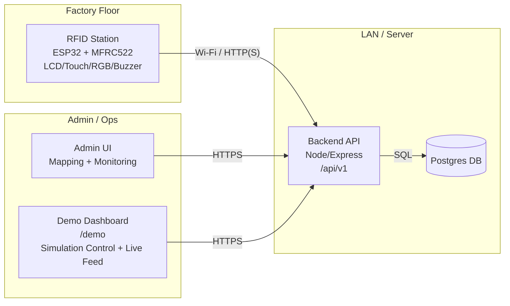
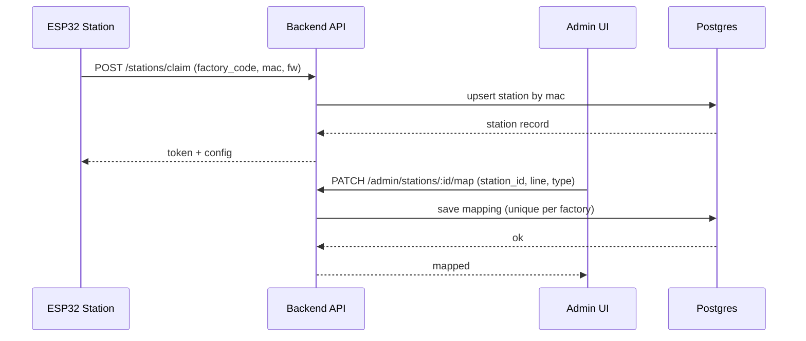
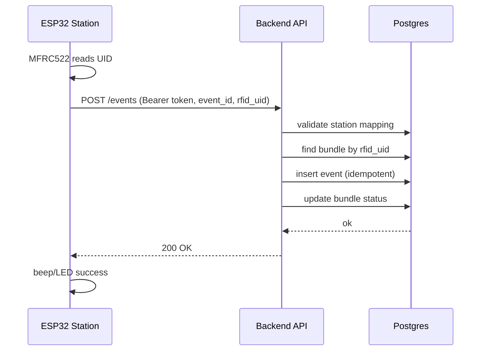

# RMG RFID ETS — Architecture

This document describes the current MVP architecture and the planned pilot-ready structure.

## Topology

- **RFID Station(s)** (ESP32) on factory Wi‑Fi
- **Backend API** (Node/Express) on LAN/server
- **Database** (Postgres)
- **Admin UI** (web) for mapping + monitoring

## Architecture diagram (C4-ish)

## Key backend contracts

### 1) Station claim
`POST /api/v1/stations/claim`

- Input: `{ factory_code, mac, fw, capabilities }`
- Output: `{ station, token, config }`

Purpose:
- Provision a station by MAC
- Issue/return a station token used for event ingest

### 2) Event ingest (station → backend)
`POST /api/v1/events` with `Authorization: Bearer <station_token>`

- Must be **idempotent** (dedupe `(station_id, event_id)`)
- Validates station mapping and bundle existence

Common failure modes:
- `409 station_unmapped`
- `404 unknown_bundle`

### 3) Bundle create
`POST /api/v1/bundles`

Purpose:
- Create a bundle record
- Assign RFID UID to bundle

## Station firmware responsibilities

- **Connectivity:** Wi‑Fi connect + keepalive
- **Clock:** SNTP time sync (for timestamps, skew checks)
- **RFID loop:** read MFRC522 UID; de-dup reads
- **Posting:** submit events to `/api/v1/events` with UID as hex
- **UX feedback:** LCD + RGB + buzzer patterns per response

## Sequence diagrams

### A) Provisioning + mapping

### B) Normal scan event

### 4) Simulation control (web dashboard)

The backend includes a web-based demo dashboard at `GET /demo` for CEO/CTO presentations.

- `POST /api/v1/simulation/start` — starts in-process simulation (admin auth)
- `POST /api/v1/simulation/stop` — stops simulation
- `GET /api/v1/simulation/status` — current state (pipeline, stats)
- `GET /api/v1/simulation/log` — SSE stream of simulation log entries

The simulation engine (`src/simulation.ts`) writes directly to the DB pool — no HTTP self-calls. It discovers mapped stations, builds a pipeline (cutting → sewing → finishing → qc), and continuously creates bundles with realistic QC scenarios (70% pass, 20% fail, 10% rework).

## Deployment notes

- Backend can run via Docker Compose for Postgres, or on a server.
- Stations use a LAN base URL (e.g., `http://192.168.1.x:3003`).

## Known risks / mitigations (hardware)

- Some GPIOs on ESP32 are **strapping pins** (boot-mode sensitive). If wiring uses GPIO12/15/2 for peripherals, boot issues may occur.
- Mitigation: ensure safe boot pull states (e.g., pulldown on GPIO12) or rewire in next revision.
