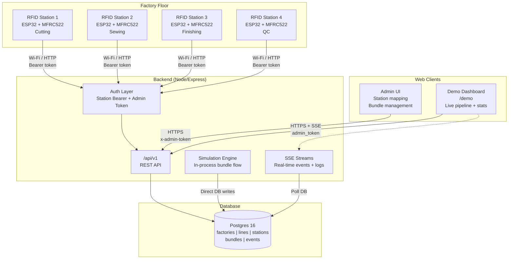
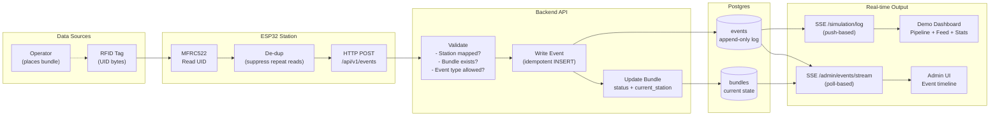
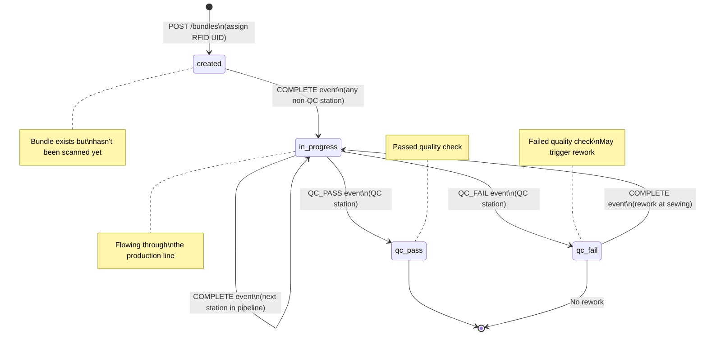
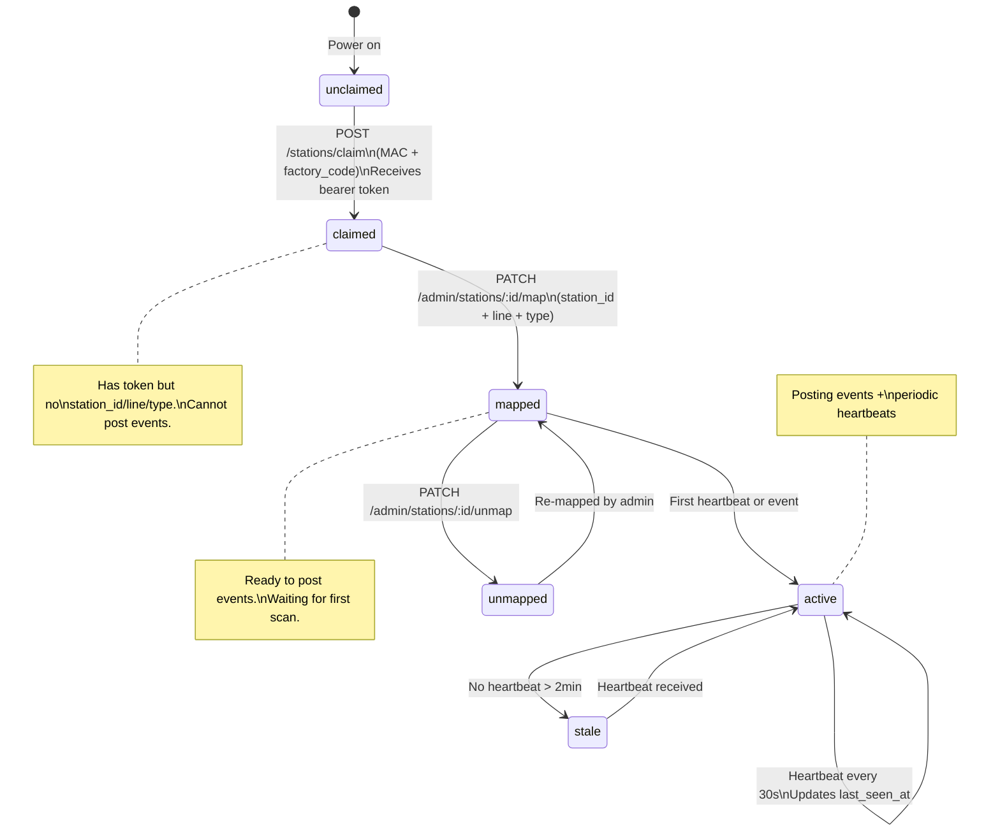
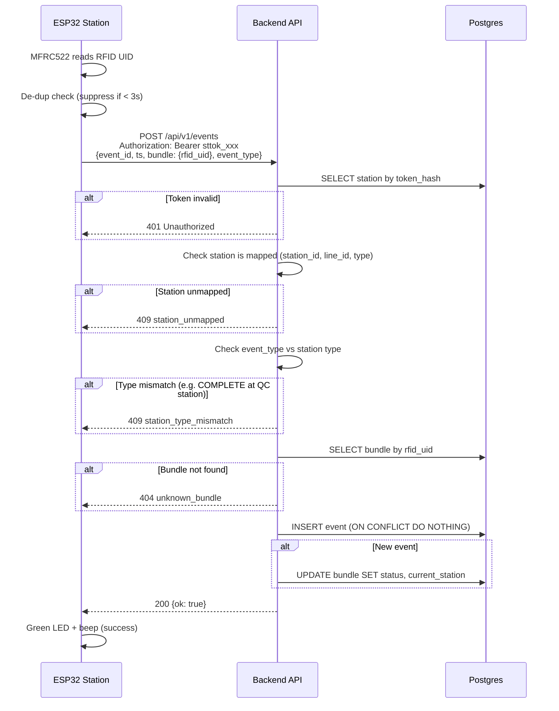
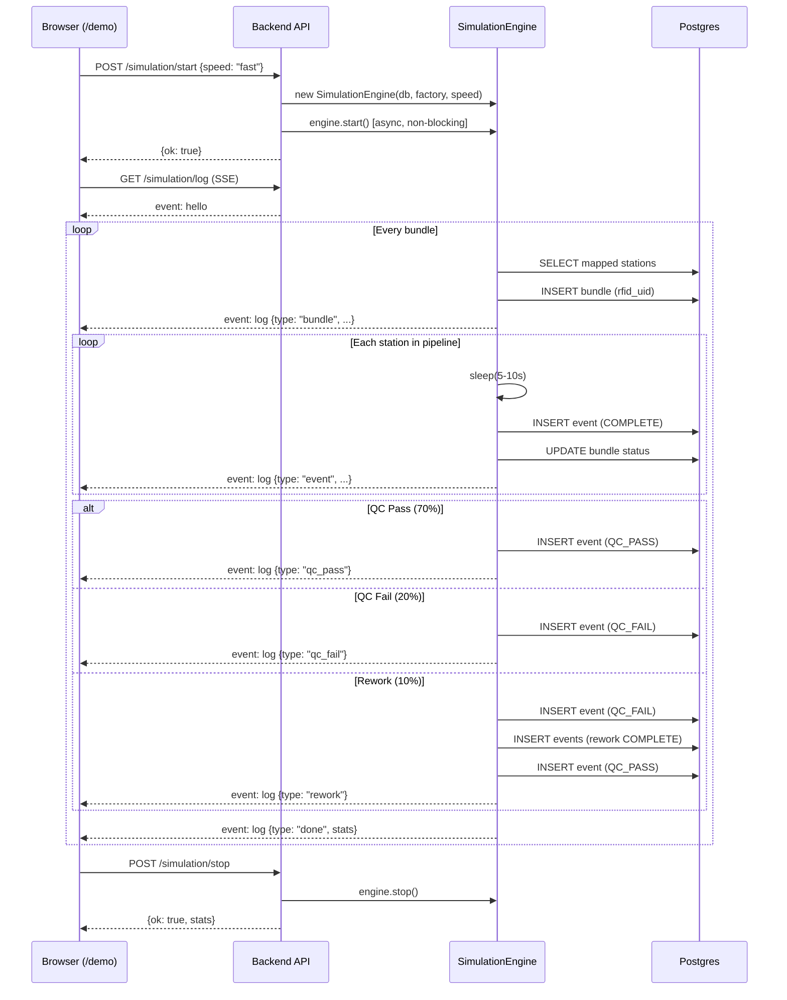
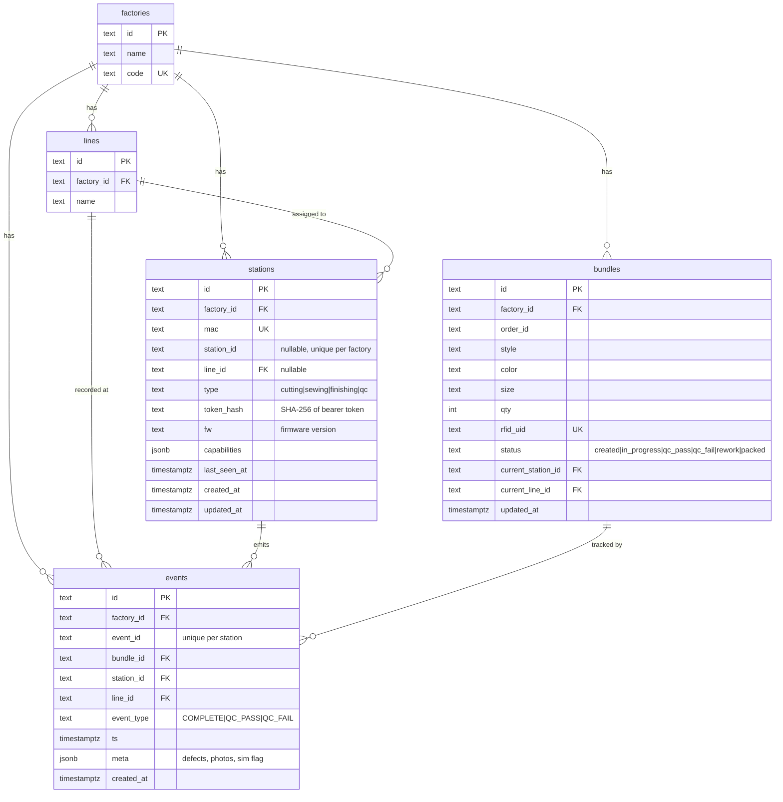

# RMG RFID ETS — Diagrams

All diagrams in Mermaid format. Render in GitHub, VS Code (Mermaid extension), or any Mermaid-compatible viewer.

---

## 1. System Architecture

High-level view of all system components and their connections.

---

## 2. Data Flow Diagram

How data moves from RFID scan to database to real-time display.

---

## 3. Bundle State Diagram

Lifecycle of a bundle from creation to final QC outcome.

---

## 4. Station Lifecycle Diagram

How a station goes from unconfigured hardware to active scanning.

---

## 5. Event Ingest Sequence

Detailed sequence of what happens when a station posts an event.

---

## 6. Demo Simulation Flow

How the web demo dashboard drives the simulation.

---

## 7. Database Entity Relationship

---

## 8. API Route Map

```mermaid
flowchart TB
  ROOT["/api/v1"]

  ROOT --> STATIONS["/stations"]
  STATIONS --> CLAIM["POST /claim\nStation provisioning"]

  ROOT --> STATION["/station"]
  STATION --> HB["POST /heartbeat\nStation heartbeat"]
  STATION --> ME["GET /me\nStation self-introspection"]

  ROOT --> EVENTS["/events"]
  EVENTS --> POST_EVT["POST /\nEvent ingest"]

  ROOT --> BUNDLES["/bundles"]
  BUNDLES --> POST_BDL["POST /\nCreate bundle"]
  BUNDLES --> POST_BULK["POST /bulk\nBulk create"]
  BUNDLES --> GET_RFID["GET /by-rfid/:uid\nLookup by RFID"]

  ROOT --> ADMIN["/admin"]
  ADMIN --> FACTORIES["GET|POST /factories"]
  ADMIN --> LINES["GET|POST /lines"]
  ADMIN --> ADM_STATIONS["GET /stations"]
  ADM_STATIONS --> MAP["PATCH /:id/map"]
  ADM_STATIONS --> UNMAP["PATCH /:id/unmap"]
  ADMIN --> ADM_EVT["/events"]
  ADM_EVT --> RECENT["GET /recent"]
  ADM_EVT --> STREAM["GET /stream (SSE)"]
  ADMIN --> ADM_BDL["/bundles"]

  ROOT --> SIM["/simulation"]
  SIM --> START["POST /start"]
  SIM --> STOP["POST /stop"]
  SIM --> STATUS["GET /status"]
  SIM --> LOG["GET /log (SSE)"]

  style CLAIM fill:#2d5a3d,stroke:#3dd68c
  style POST_EVT fill:#2d5a3d,stroke:#3dd68c
  style STREAM fill:#2d4a5a,stroke:#63b3ed
  style LOG fill:#2d4a5a,stroke:#63b3ed
  style START fill:#5a4a2d,stroke:#ecc94b
  style STOP fill:#5a2d2d,stroke:#f56565
```

